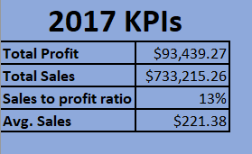
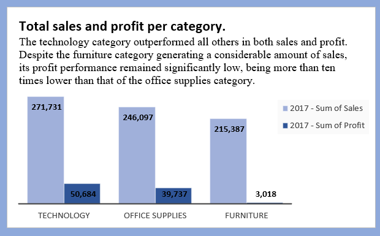
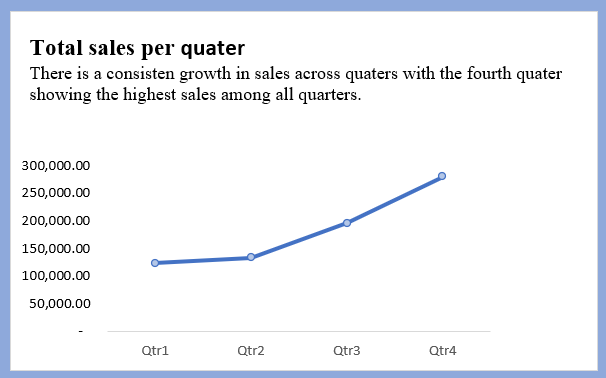

# Data-Analysis-for-US-superstore
# Introduction
This is the capstone excel project that marks the end of the Excel training in the Data Analysis Training cohort 3 by Chinonso Promise. This project involves understanding business questions, data cleaning, data analysis and reports using data visualisation.

# Skills Demonstrated
For the effective execution of the project and to gain insight to aid informed business decision making, the following skills were demonstrated
1.	Understanding of business problem
2.	Problem-solving skills
3.	Data cleaning
4.	Data analysis using pivot tables
5.	Data visualisation and reports
   
# Dataset
The dataset consists of 20 columns and 9994 rows. 

# Data Cleaning
To clean the data, the first step involved checking for duplicates and blanks, which were not found. Next, the date column was formatted as "date," and efforts were made to ensure uniformity in the date format throughout the dataset. 

# Cleaned Dataset

# Problem Statement
To prepare for the upcoming business year, the Manager seeks comprehensive insights into the sales and profit performance of the previous year. The goal is to identify areas requiring improvement to enhance sales and profits in the coming year. The analysis will focus on key aspects such as customer segments, sales per quater,, months, products, and regions to provide valuable recommendations for strategic decision-making. By addressing these areas, the company aims to boost its overall performance and achieve greater success in the new business year.
The following business questions would be answered in order to gain the required insights;

1. What is the total sales and profit per category for the business year?
2. Which quater in 2017 had the highest sales?
3. Which states returned the least sales in the business year?
4. Which segment contributes the most to the business revenue in the business year?
5. Which month has the highest orders?
6. What is the sales and profit growth across the years?

# Data Analysis
The entirety of this analysis was done using the pivot table.
I started off my analysis by comparing the sales and profit growth rate across the years. The previous year, 2017 generated more sales and profit compared to other years. 
         

1. What is the total sales and profit per category for the business year?
   

2. Which quater in 2017 had the highest sales?
   

3. Which states returned the least sales in the business year?
   

4. Which segment contributes the most to the business revenue in the business year?

5. Which month has the highest orders?
   

   
6. What is the sales and profit growth across the years?
   

