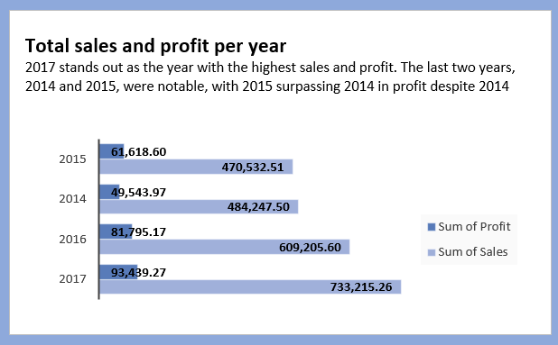
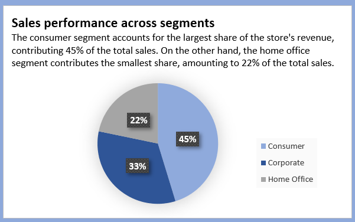

# Data-Analysis-for-US-superstore

# Introduction
This is the capstone Excel project that marks the end of the Excel training in the Data Analysis Training cohort 3 by Chinonso Promise. This project involves understanding and answering business questions, data cleaning, data analysis, and data visualisation and reports.

# Skills Demonstrated
For the effective execution of the project and to gain insight to aid informed business decision-making, the following skills were demonstrated
1.	Understanding of the business problem
2.	Problem-solving skills
3.	Data cleaning
4.	Data analysis using pivot tables
5.	Data visualisation and reports
   
# Dataset
The dataset consists of 20 columns and 9994 rows. 

# Data Cleaning
To clean the data, the first step involved checking for duplicates and blanks, and they were none. Next, the date column was formatted as "date", and the date format was made uniform throughout the dataset. 

# Cleaned Dataset

# Problem Statement
To prepare for the upcoming business year, the Manager seeks comprehensive insights into the sales and profit performance of the previous year. The goal is to identify areas requiring improvement to enhance sales and profits in the coming year. The analysis will focus on key aspects such as customer segments, sales per quarter, months, products, and regions to provide valuable recommendations for strategic decision-making. By addressing these areas, the company aims to boost its overall performance and achieve greater success in the new business year.

The following business questions would be answered in order to gain the required insights;

1. What is the total sales and profit per category for the business year?
2. Which quarter in 2017 had the highest sales?
3. Which states returned the least sales in the business year?
4. Which segment contributes the most to the business revenue in the business year?
5. Which month has the highest orders?

# Data Analysis
*The entirety of this analysis was done using the pivot table.*

To commence my analysis, I first compared the growth rates of sales and profit across different years. Notably, the previous year, 2017, outperformed other years in terms of both sales and profit. Monitoring these key performance indicators (KPIs) provides valuable insights into the progress of sales and profit over time. By identifying areas for improvement and implementing necessary adjustments, the goal is to ensure that the upcoming year surpasses previous years, fostering successful growth and expanding the business.

         

Subsequently, I proceeded to address the aforementioned business questions, aiming to obtain valuable insights that would pave the way for providing strategic recommendations. These insights are essential for making informed decisions that will ultimately enhance the overall performance of the business.

# 1. What is the total sales and profit per category for the business year and what is the monthly order frequency of each category?
   
       

This insight holds significant importance in determining the category that generates the highest revenue for the company and understanding customer preferences. According to the charts, the *technology* category emerges as the top revenue generator. On the other hand, the *office supplies* category demonstrates strong popularity among customers, evidenced by its consistent and notably higher order frequency, surpassing that of the technology category by over three times. Understanding these customer preferences and demand patterns allows the business to tailor marketing campaigns and adjust inventory levels accordingly. By aligning with customer needs and attracting potential buyers, the business can enhance customer satisfaction, drive increased sales, and ultimately boost profitability.

# 2. Which quarter in 2017 had the highest sales?
   

The insight highlights the specific period during which the company experiences its peak sales performance throughout the year. Having this information enables the business to optimize its operations, allocate resources effectively, and devise tailored marketing strategies.
According to the chart above, sales exhibit a consistent increase as the year progresses. Notably, the fourth quarter stands out with substantial growth in sales, surpassing the combined sales of both the first and second quarters. This significant surge in sales during the fourth quarter emphasizes its importance as the peak period for revenue generation.

Understanding the sales trends and the dominance of the fourth quarter allows the business to capitalize on this high-demand period effectively. By aligning strategies and resources to meet customer needs during this time, the company can maximize profitability and ensure the most successful outcome for the entire year.

# 3. Which states returned the least sales in the business year?
   

The insight into states that generated the least sales is crucial for identifying underperforming regions and making strategic decisions to improve overall sales and profitability. By pinpointing the states with weaker sales performance, the business can assess whether implementing new marketing strategies would be effective or if it is more prudent to consider reallocating resources or potentially closing down stores in those states.
This analysis will aid in channeling funds to states that demonstrate better sales performance, thereby optimizing revenue generation and profitability for the business. Ultimately, making informed decisions based on this insight will drive growth and success by focusing efforts on regions with higher sales potential and aligning the company's resources with the most promising opportunities.
The chart above shows the least 5 performing states per sale. 

# 4. Which segment contributes the most to the business revenue in the business year?

This analysis helps the business identify the segment that generates the most revenue for the business. This would help the business tailor marketing and sales strategies to further engage and retain these segments thereby fostering customer loyalty and potentially driving more revenue in the coming year. 

According to the chart, the consumer segment emerges as the top revenue contributor, accounting for nearly 50 percent (45%) of the total revenue.

# 5. Which month has the highest orders?
   

This insight provides valuable information for making informed decisions, developing strategies, enhancing customer experience, and maximizing sales performance and revenue generation. By leveraging the insight effectively, the business can better cater to customer demands, optimise operations and drive overall success.
According to the chart, the month of December slightly surpasses October and November, making it the month with the highest order while February is the month with the least orders. 

# Recommendations

